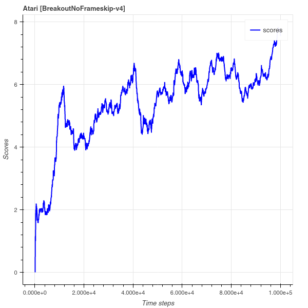

# LetsPlayAtari
This is a reposiry where I benchmark my implenation of reinforcement algorthems on Atari games. The alogorthems are implemtend in Pytorch. 

### Usage
You can train the model by executing the following command:
```bash
python atariPOO.py
```
### Results
Currently it takes roughly 2h 20min to to run 100k time steps with 8 parallel environemnts on a 15-4300u cpu using Proximal Policy Optimization. Achieving an average run score of 7 (of the past 100 time steps) on BreakoutNoFrameskip-v4

<p align="center">
     
     
</p>

Currenlty episodes are arbitrary defined as 128 time steps. This allows me to rigidly define memory buffer size

### Notes
- This is not complete work. expect a few more updates
- Weights and bais are obtaining a average score of about 15 at about 100k time steps. https://wandb.ai/cleanrl/cleanrl.benchmark/reports/Atari--VmlldzoxMTExNTI
- more tuning needs to be done, increasing buffer size 1024, learning rate to 0.00025 and what score is recorded
- 
### Reference 
[PPO-Implementation-Deep-Dive](https://github.com/vwxyzjn/PPO-Implementation-Deep-Dive), Great starting point
[Proximal Policy Optimization - PPO in PyTorch](https://blog.varunajayasiri.com/ml/ppo_pytorch.html)
